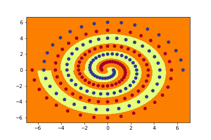
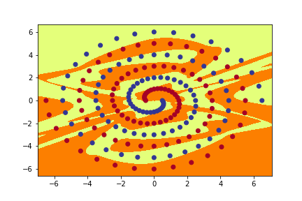

# COMP9444  DEEP LEARNING   HOMEWORK 1    YEAR: 2020    TERM: 02

# AIM

- Implementing and training neural network models for two different classification tasks, and analysing the results.

# SUBMISSION INSTRUCTIONS

- Submit two python files kuzu.py and sprial.py as well as a written report hw1.pdf

## PROVIDED FILES

-   spirals.csv.
-   kuzu.py.
-   spiral.py.
-   kuzu_main.py.
-   spiral_main.py.

<b>Note:</b> complete the skeleton files kuzu.py, spiral.py and submit them, along with your report.

# PART 1:   JAPANESE CHARACTER RECOGNITION

## OBJECTIVE

- Implementing networks to recogize handwritten Hiragana sysmbols.

## DATASET

- The dataset to be used is Kuzushiji-MNIST(KMNIST).

- The paper describing the dataset is available at https://arxiv.org/pdf/1812.01718.pdf.

### SUMMARY OF DATASET

- Significant changes occurred to the language when Japan reformed their education system in 1868, and the majority of Japanese today cannot read texts published over 150 years ago.

- This paper presents a dataset of handwritten, labeled examples of this old-style script (Kuzushiji).

- The dataset we will be using is a much simpler one, containing 10 Hiragana characters with 7000 samples per class.

## SUB-PART 1

### OBJECTIVE

- Implement a model NetLin which computes a linear function of the pixels in the image, followed by log softmax. Run the code by typing:
python3 kuzu_main.py --net lin
also include final accuracy and confusion matrix into your report.

### IMPLEMENTATION

- Please refer to NetLin class in kuzu.py for implementation of this part.
- Technology Used: Python and PyTorch.

### RESULTS

#### Final Confusion matrix 

[[765. 7. 7. 4. 59. 8. 5. 16. 11. 8.]
 

[ 5. 671. 65. 37. 51. 26. 23. 29. 37. 52.]
 

[ 8. 109. 689. 61. 84. 125. 150. 26. 94. 85.]
 

[ 12. 18. 26. 759. 21. 17. 10. 12. 42. 3.]
 

[ 31. 27. 27. 14. 623. 20. 27. 89. 6. 51.]
 

[ 65. 22. 21. 56. 20. 726. 25. 19. 32. 34.]
 

[ 2. 58. 45. 14. 33. 27. 719. 53. 45. 19.]
 

[ 61. 14. 37. 17. 34. 8. 21. 620. 6. 31.]
 

[ 32. 25. 44. 26. 19. 32. 9. 89. 704. 39.]
 

[ 19. 49. 39. 12. 56. 11. 11. 47. 23. 678.]]

- The columns of the confusion matrix indicate the target character.
- The rows indicate the one chosen by the network. (0="o", 1="ki", 2="su", 3="tsu", 4="na", 5="ha", 6="ma", 7="ya", 8="re", 9="wo")

####  Final Accuracy  and Average loss for Test Dataset

Average loss: 1.0107, Accuracy: 6954/10000 (70%)

## SUB-PART 2

### OBJECTIVE

- Implement a fully connected 2-layer network NetFull, using tanh at the hidden nodes and log softmax at the output node. Run the code by typing:
python3 kuzu_main.py --net full

- Try different values (multiples of 10) for the number of hidden nodes and try to determine a value that achieves high accuracy on the test set. Copy the final accuracy and confusion matrix into your report.

### IMPLEMENTATION

- Please refer to NetFull class in kuzu.py for implementation of this part.
- Technology Used: Python and PyTorch.

### RESULTS

#### Final Confusion matrix 

[[850. 6. 7. 2. 37. 11. 3. 17. 11. 4.]
 

[ 5. 814. 13. 8. 31. 17. 14. 11. 28. 19.]
 

[ 2. 37. 831. 24. 16. 84. 40. 20. 29. 49.]
 

[ 6. 2. 46. 927. 7. 6. 10. 6. 55. 4.]
 

[ 26. 20. 10. 3. 823. 11. 16. 16. 4. 28.]
 

[ 36. 10. 19. 15. 6. 832. 6. 8. 8. 4.]
 

[ 2. 58. 26. 5. 28. 17. 894. 33. 28. 21.]
 

[ 42. 5. 13. 2. 14. 1. 7. 836. 2. 17.]

####  Final Accuracy  and Average loss for Test Dataset

Average loss: 0.4935, Accuracy: 8482/10000 (85%)

####    Different Values For The Number of Hidden Nodes.

<table  style = "width:100%">
    <tr>
        <th>Num_id</th>
        <th>Accuracy(%)</th>
    </tr>
    <tr>
        <td>500</td>
        <td>85%</td>
    </tr>
    <tr>
        <td>1000</td>
        <td>85%</td>
    </tr>
    <tr>
        <td>1500</td>
        <td>84%</td>
    </tr>
    <tr>
        <td>2000</td>
        <td>84%</td>
    </tr>
    <tr>
        <td>3000</td>
        <td>84%</td>
    </tr>
</table>

## SUB-PART 3

### OBJECTIVE

- Implement a convolutional network called NetConv, with two convolutional layers plus one fully connected layer, all using relu activation function, followed by the output layer. Run the code by typing:
python3 kuzu_main.py --net conv

- You are free to choose for yourself the number and size of the filters, metaparameter values, and whether to use max pooling or a fully convolutional architecture.

- Your network should consistently achieve at least 93% accuracy on the test set after 10 training epochs. Copy the final accuracy and confusion matrix into your report.

### IMPLEMENTATION

- Please refer to NetConv class in kuzu.py for implementation of this part.
- Technology Used: Python and PyTorch.

### RESULTS

#### Final Confusion matrix 

[[939. 3. 11. 3. 19. 6. 5. 5. 3. 6.]
 

[ 7. 926. 11. 1. 14. 19. 10. 12. 22. 12.]
 

[ 3. 4. 894. 18. 4. 50. 21. 10. 15. 11.]
 

[ 1. 0. 36. 957. 3. 9. 3. 2. 11. 2.]
 

[ 28. 3. 2. 2. 912. 3. 7. 8. 5. 5.]
 

[ 3. 2. 10. 6. 4. 887. 3. 1. 5. 0.]
 

[ 2. 46. 19. 3. 17. 14. 946. 16. 10. 5.]
 

[ 11. 3. 3. 5. 10. 6. 2. 926. 4. 3.]
 

[ 2. 2. 7. 1. 9. 2. 1. 2. 922. 2.]
 

[ 4. 11. 7. 4. 8. 4. 2. 18. 3. 954.]]

####  Final Accuracy  and Average loss for Test Dataset

Average loss: 0.2747, Accuracy: 9263/10000 (93%)

####    Training table showing consistent accuracy of at least 93% on the test set after 10 training epochs.

<table  style = "width:100%">
    <tr>
        <th>Training No.</th>
        <th>Accuracy(%)</th>
    </tr>
    <tr>
        <td>1</td>
        <td>93%</td>
    </tr>
    <tr>
        <td>2</td>
        <td>93%</td>
    </tr>
    <tr>
        <td>3</td>
        <td>93%</td>
    </tr>
    <tr>
        <td>4</td>
        <td>93%</td>
    </tr>
    <tr>
        <td>5</td>
        <td>93%</td>
    </tr>
</table>

## SUB-PART 4

### OBJECTIVE

- Discuss what you have learned from this exercise, including the following points:
    - the relative accuracy of the three models,
    - the confusion matrix for each model: which characters are most likely to be mistaken for which other characters, and why?
    - you may wish to experiment with other architectures and/or metaparameters for this dataset, and report on your results; the aim of this exercise is not only to achieve high accuracy but also to understand the effect of different choices on the final accuracy.

### IMPLEMENTATION

- Please refer to COMP9444_HW1_FinalReport.pdf.

### RESULTS

- Please refer to COMP9444_HW1_FinalReport.pdf.

#  PART 2: Twin Spirals Task

## OBJECTIVE 

- Implement various neural networks to learn the famous Two Spiral Problem (Lang and Witbrock, 1988).

## DATASET

- dataset file: spiral.csv.

- X-cord of the spiral.
- Y-cord of the spiral.
- Class of the spiral (0 or 1).

## PROVIDED FILES

- spiral_main.py: loads the training data from spirals.csv, applies the specified model and produces a graph of the resulting function, along with the data.

## SUB-PART 1 AND 2

### OBJECTIVE

- Implement a Pytorch Module called PolarNet which operates as follows: First, the input (x,y) is converted to polar co-ordinates (r,a) with r=sqrt(x*x + y*y), a=atan2(y,x). Next, (r,a) is fed into a fully connected neural network with one hidden layer using tanh activation, followed by a single output using sigmoid activation. Run the code by typing
python3 spiral_main.py --net polar --hid 10.

- Try to find the minimum number of hidden nodes required so that this PolarNet learns to correctly classify all of the training data within 20000 epochs, on almost all runs.

#### IMPLEMENTATION

- Please refer to PolarNet class in spiral.py for implementation of this part.
- Technology Used: Python and PyTorch.

#### OUTPUT

<table style = "width:100%">
    <tr>
        <th colspan = "3">Final Value of Num_hid = 7</th>
    </tr>
    <tr>
        <th>Training no</th>
        <th>Epoch No</th>
        <th>Percentage(%)</th>
    </tr>
    <tr>
        <td>1</td>
        <td>20,000</td>
        <td>91.75</td>
    </tr>
    <tr>
        <td>2</td>
        <td>12,100</td>
        <td>100</td>
    </tr>
    <tr>
        <td>3</td>
        <td>4,100</td>
        <td>100</td>
    </tr>
    <tr>
        <td>4</td>
        <td>5,300</td>
        <td>100</td>
    </tr>
    <tr>
        <td>5</td>
        <td>20,000</td>
        <td>77.84</td>
    </tr>
    <tr>
        <td>6</td>
        <td>10,400</td>
        <td>100</td>
    </tr>
    <tr>
        <td>7</td>
        <td>9,200</td>
        <td>100</td>
    </tr>
    <tr>
        <td>8</td>
        <td>5,000</td>
        <td>100</td>
    </tr>
    <tr>
        <td>9</td>
        <td>11,800</td>
        <td>100</td>
    </tr>
    <tr>
        <td>10</td>
        <td>20,000</td>
        <td>91.75</td>
    </tr>
</table>

## SUB-PART 3 AND 4

### OBJECTIVE

- Implement a Pytorch Module called RawNet which operates on the raw input (x,y) without converting to polar coordinates. Your network should consist of two fully connected hidden layers with tanh activation, plus the output layer, with sigmoid activation. Run the code by typing python3 spiral_main.py --net raw.

- You should not use Sequential but should instead build the network from individual components.

- The number of neurons in both hidden layers should be determined by the parameter num_hid.

- Keeping the number of hidden nodes in each layer fixed at 10, try to find a value for the size of the initial weights (--init) such that this RawNet learns to correctly classify all of the training data within 20000 epochs, on almost all runs. 

#### IMPLEMENTATION

- Please refer to RawNet class in spiral.py for implementation of this part.
- Technology Used: Python and PyTorch.

#### OUTPUT

<table style = "width:100%">
    <tr>
        <th>Hyperparameters for the final model</th>
    </tr>
    <tr>
        <td>Learning Rate</td>
        <td>0.01</td>
    </tr>
    <tr>
        <td>Number of hidden nodes</td>
        <td>10</td>
    </tr>
    <tr>
        <td>Initial weight size</td>
        <td>0.1</td>
    </tr>
</table>

<table style = "width:100%">
    <tr>
        <th colspan = "3">Final Value of Intial Weight Size = 0.21</th>
    </tr>
    <tr>
        <th>Training no</th>
        <th>Epoch No</th>
        <th>Percentage(%)</th>
    </tr>
    <tr>
        <td>1</td>
        <td>7,900</td>
        <td>100</td>
    </tr>
    <tr>
        <td>2</td>
        <td>4,900</td>
        <td>100</td>
    </tr>
    <tr>
        <td>3</td>
        <td>8,000</td>
        <td>100</td>
    </tr>
    <tr>
        <td>4</td>
        <td>20,000</td>
        <td>98.97</td>
    </tr>
    <tr>
        <td>5</td>
        <td>4,100</td>
        <td>100</td>
    </tr>
    <tr>
        <td>6</td>
        <td>20,000</td>
        <td>95.88</td>
    </tr>
    <tr>
        <td>7</td>
        <td>8,700</td>
        <td>100</td>
    </tr>
    <tr>
        <td>8</td>
        <td>9,000</td>
        <td>100</td>
    </tr>
    <tr>
        <td>9</td>
        <td>9,300</td>
        <td>100</td>
    </tr>
    <tr>
        <td>10</td>
        <td>20,000</td>
        <td>97.42</td>
    </tr>
</table>

## SUB-PART 5 AND 6

### OBJECTIVE

- Implement a Pytorch Module called ShortNet which again operates on the raw input (x,y) without converting to polar coordinates.

- This network should again consist of two hidden layers (with tanh activation) plus the output layer (with sigmoid activation), but this time should include short-cut connections between every pair of layers (input, hid1, hid2 and output). Run the code by typing
python3 spiral_main.py --net short

-  In your code the number of neurons in both hidden layers should be determined by the parameter num_hid.

- You should experiment to find a good value for the initial weight size, and try to find the mininum number of hidden nodes per layer so that this ShortNet learns to correctly classify all of the training data within 20000 epochs, on almost all runs.

#### IMPLEMENTATION

- Please refer to RawNet class in spiral.py for implementation of this part.
- Technology Used: Python and PyTorch.

#### OUTPUT

<table style = "width:100%">
    <tr>
        <th>Hyperparameters for the final model</th>
    </tr>
    <tr>
        <td>Learning Rate</td>
        <td>0.01</td>
    </tr>
    <tr>
        <td>Number of hidden nodes</td>
        <td>10</td>
    </tr>
    <tr>
        <td>Initial weight size</td>
        <td>0.1</td>
    </tr>
</table>

<table style = "width:100%">
    <tr>
        <th colspan = "3">Final Value of Intial Weight Size = 0.21</th>
    </tr>
    <tr>
        <th>Training no</th>
        <th>Epoch No</th>
        <th>Percentage(%)</th>
    </tr>
    <tr>
        <td>1</td>
        <td>7,900</td>
        <td>100</td>
    </tr>
    <tr>
        <td>2</td>
        <td>4,900</td>
        <td>100</td>
    </tr>
    <tr>
        <td>3</td>
        <td>8,000</td>
        <td>100</td>
    </tr>
    <tr>
        <td>4</td>
        <td>20,000</td>
        <td>98.97</td>
    </tr>
    <tr>
        <td>5</td>
        <td>4,100</td>
        <td>100</td>
    </tr>
    <tr>
        <td>6</td>
        <td>20,000</td>
        <td>95.88</td>
    </tr>
    <tr>
        <td>7</td>
        <td>8,700</td>
        <td>100</td>
    </tr>
    <tr>
        <td>8</td>
        <td>9,000</td>
        <td>100</td>
    </tr>
    <tr>
        <td>9</td>
        <td>9,300</td>
        <td>100</td>
    </tr>
    <tr>
        <td>10</td>
        <td>20,000</td>
        <td>97.42</td>
    </tr>
</table>

## SUB-PART 7

### OBJECTIVE

- Implement a method called graph_hidden(net, layer, node) which plots the activation (after applying the tanh function) of the hidden node with the specified number (node) in the specified layer (1 or 2).

- (Note: if net is of type PolarNet, graph_output() only needs to behave correctly when layer is 1).

- Use this code to generate plots of all the hidden nodes in PolarNet, and all the hidden nodes in both layers of RawNet and ShortNet, and include them in your report.

#### IMPLEMENTATION

- Please refer to graph_hidden method in spiral.py for implementation of this part.
- Technology Used: Python and PyTorch.

#### OUTPUT

- Please refer to the outputs folder for a specific neural net.